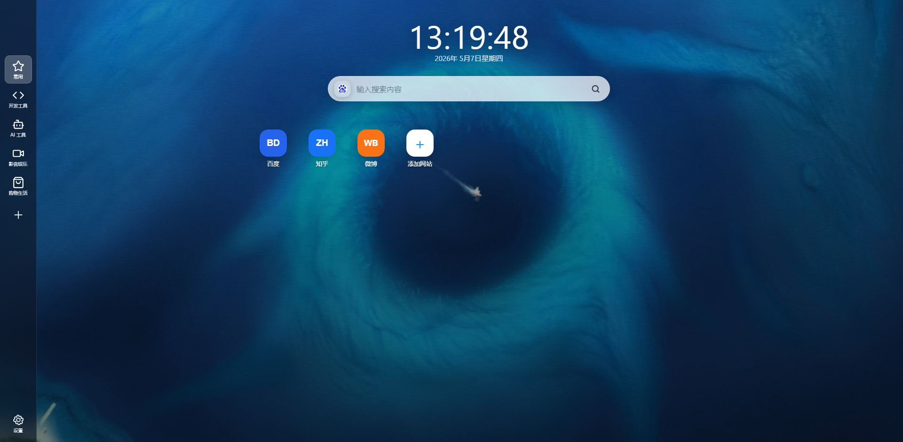
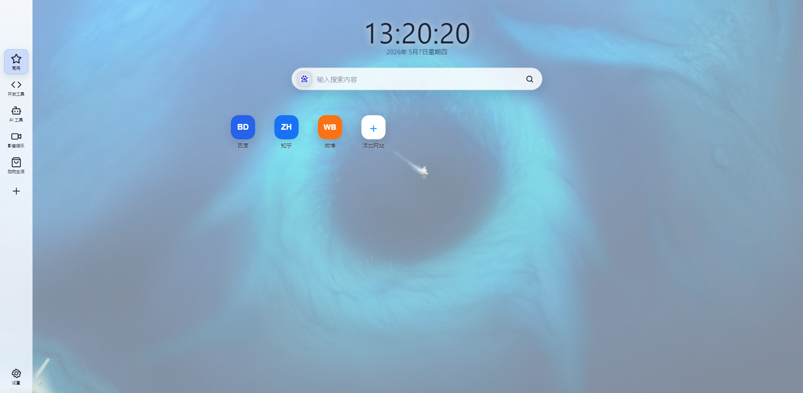
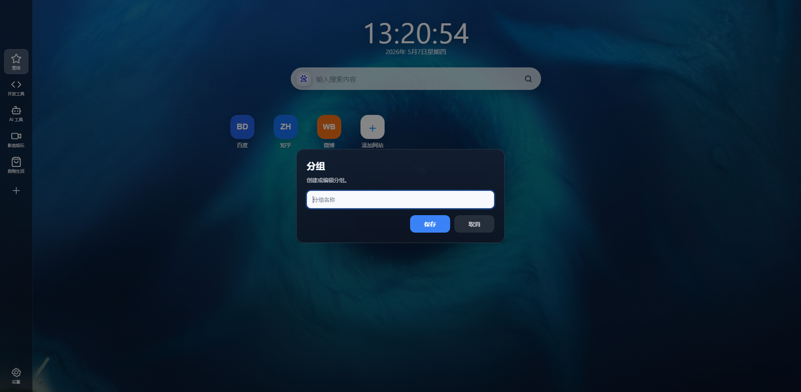
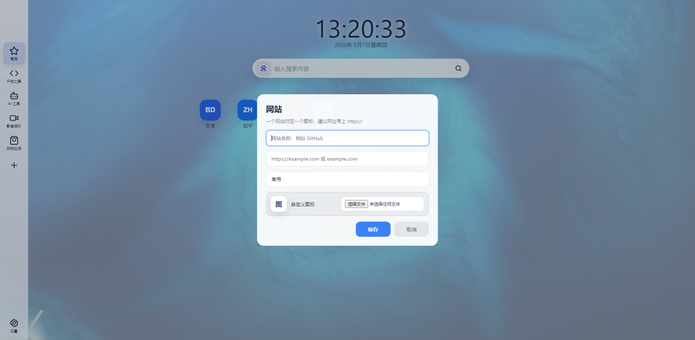
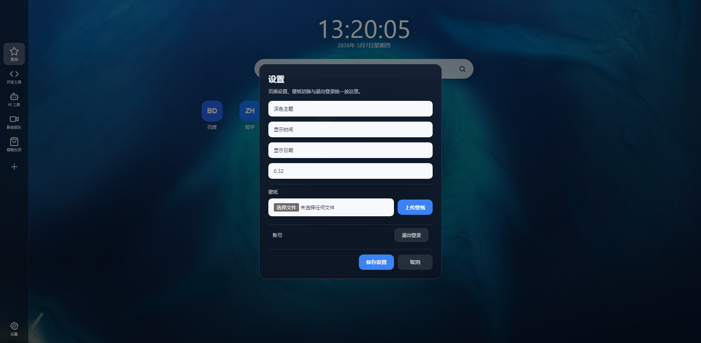

# TabHub

[English](README.en-US.md) | 中文

TabHub 是一个轻量的自托管书签导航页，使用 Go、SQLite 和原生前端构建。适合个人服务器、NAS、内网首页和浏览器主页使用。



## 服务器需求

项目是单 Go 进程 + SQLite + 原生前端，`docker-compose.yml` 默认设置了 `GOMEMLIMIT=64MiB`，所以个人使用时 64 MB 内存也可以流畅运行。注意：Docker 构建阶段会比运行阶段更吃内存，低配服务器建议在本地构建后部署，或使用已经构建好的镜像。

## 功能亮点

- 分组管理：左侧分组支持新增、编辑、删除和拖动排序。
- 网站管理：添加网站时可填写名称、网址和所属分组。
- 图标管理：自动获取网站 favicon，支持刷新图标，也支持自定义上传 PNG、JPG、GIF、SVG、WEBP、ICO 图标。
- 图标显示：透明图标在固定图标框内按比例最大化、居中、不裁剪。
- 网站排序：同一分组内的网站图标支持拖动排序。
- 搜索引擎：支持添加搜索引擎、右键编辑/删除、点击切换默认搜索引擎。
- 壁纸管理：支持上传、切换、删除壁纸，登录页会使用当前默认壁纸。
- 主题切换：支持深色和亮色主题，设置会持久保存。
- 设置弹窗：统一管理主题、时间日期显示、遮罩透明度、壁纸和退出登录。
- 单用户模式：启动时会按 `config.env` 同步管理员账号，数据库只保留一个用户。
- 首次启动：空数据库会自动生成默认分组和常用网站，让页面打开就有完整效果。

## 界面预览

### 深色主题


### 亮色主题



### 添加分组



### 添加网站



### 设置



## 快速开始

本地运行：

```powershell
go run ./cmd/server
```

默认读取项目根目录的 `config.env`：

```env
APP_NAME=TabHub
PORT=8080
HOST_PORT=5305
ADMIN_USERNAME=admin
ADMIN_PASSWORD=admin
SESSION_SECRET=change-this-session-secret
SESSION_DAYS=60
DB_PATH=./data/app.db
DATA_DIR=./data
TZ=Asia/Shanghai
DEFAULT_SEARCH_ENGINE=https://www.baidu.com/s?wd=%s
```

访问：

```text
http://127.0.0.1:8080
```

## Docker 部署

```powershell
docker compose --env-file config.env up -d --build
```

`PORT` 是容器内监听端口，`HOST_PORT` 是宿主机访问端口。数据默认持久化到 `./data`。

## 数据目录

- `data/app.db`：SQLite 数据库。
- `data/uploads/icons`：上传和抓取的网站图标。
- `data/uploads/wallpapers`：用户上传壁纸。
- `web/static/default-wallpaper.jpg`：内置默认壁纸。
- `web/static/default-icons`：首次启动默认网站使用的内置图标。

## 打赏支持

如果这个项目对你有帮助，可以扫码打赏支持维护。


## 开源协议

本项目使用 [MIT License](LICENSE)。

你可以自由使用、修改、分发和商业使用，但需要保留版权声明和许可证文本，也就是商业使用时需要署名。
